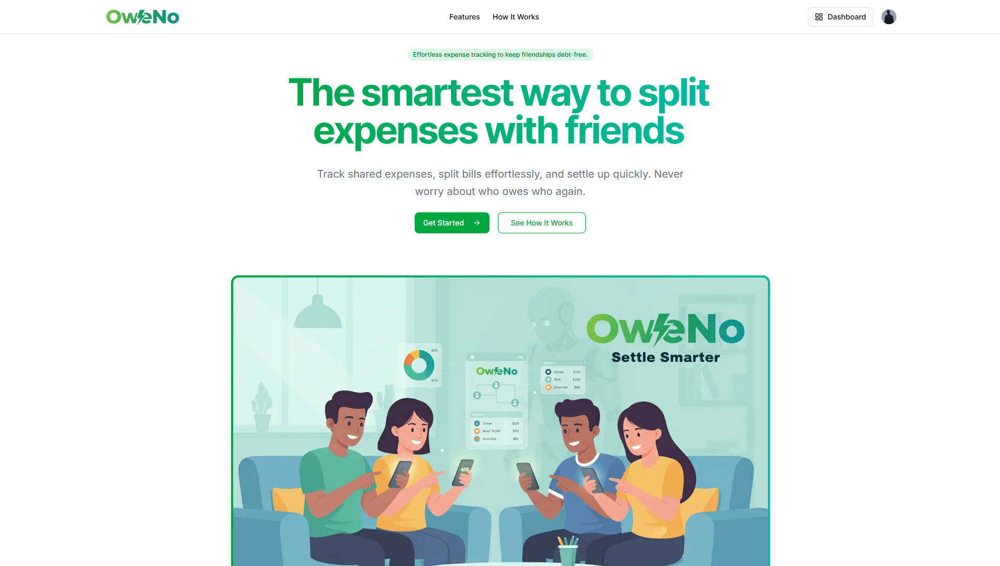
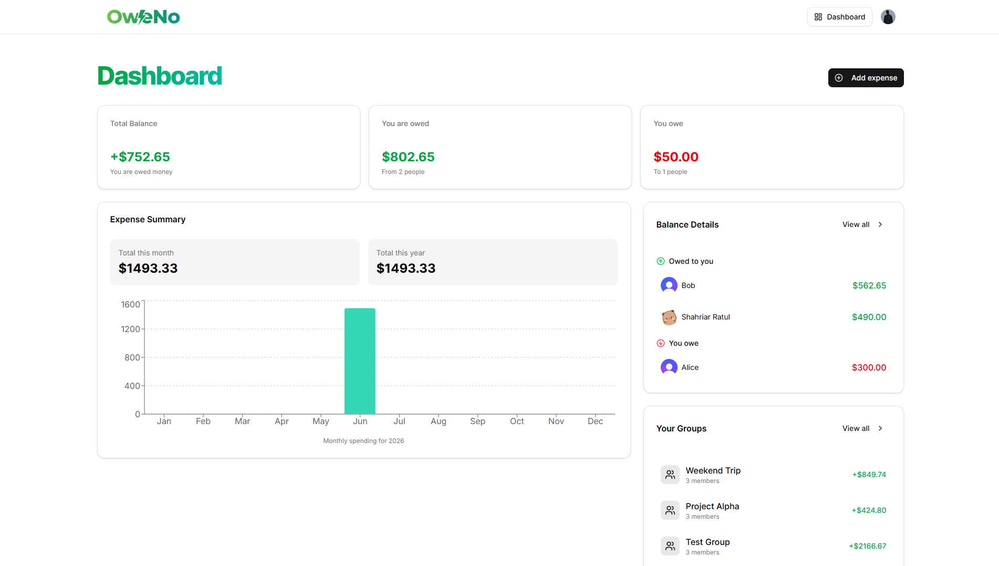
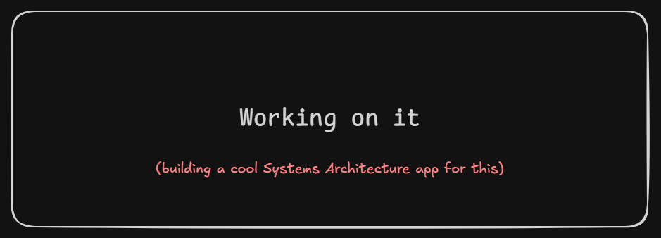

# OweNo


OweNo is a modern full-stack expense splitting platform for individuals and groups, built with real-time infrastructure and event-driven background processing. It supports both one-to-one and group-based financial tracking and enables users to track shared expenses, settle balances, manage group finances, and receive automated reminders - all in a synchronized real-time system powered by Convex.

<p align="center">
  <strong>
    💸 Split Expenses • 🤝 Settle Debts • 👥 Manage Groups • 📊 Track Balances
  </strong>
</p>

<p align="center">
  <strong>
    ⚡ Real-time Sync • 🧠 Smart Balance Engine • 📬 AI Powererd Automated Reminders • 🏗 Scalable Architecture
  </strong>
</p>


## Live Demo

> workingonit.com


## Features

- **Group Expense Management** — Create groups and split shared expenses
- **One-to-One Settlements** — Track direct debts between users
- **Smart Balance Engine** — Automatic netting of multi-user debts
- **Real-time Dashboards** — Live group and personal financial overview
- **Secure Authentication** — Clerk-based authentication system
- **Background Automation** — Scheduled reminders via Inngest
- **Email Notifications** — Automated payment reminder system
- **Detailed Expense Tracking** — Categorized expense history
- **Settlement Optimization** — Reduces circular debt efficiently

## UI Preview

### Landing Page


### Dashboard


### Group Expense


## Why OweNo?

Most expense tracking systems simply store transactions and compute balances in a basic way.

OweNo is designed as a **real-time financial state system**, where balances are continuously derived from a structured ledger of expenses and settlements. Instead of treating expenses as static records, OweNo models them as part of a **live financial graph between users**. It introduces a multi-layer financial reconciliation engine:

* Tracks both expenses and settlements
* Computes bidirectional debt relationships
* Applies netting logic to simplify circular debts
* Maintains both group-level and user-level balance views
* Ensures consistency across one-to-one and group contexts

This makes OweNo closer to a real financial ledger system than a simple split app that is - **Consistent, Recomputable, Real-time safe & Extensible for AI insights and automation.**


## Entire Workflow

```
User Action (Add Expense / Settle Debt)
        ↓
Next.js App Router (UI Layer)
        ↓
Convex Mutation / Query Layer
        ↓
Validation + Auth (Clerk + Convex auth)
        ↓
Database Write (expenses / settlements / groups)
        ↓
Ledger Computation Engine
    ├── Pairwise balance calculation
    ├── Split validation
    ├── Settlement adjustment
    └── Debt netting optimization
        ↓
Real-time Convex sync updates
        ↓
UI reactivity (React + Convex hooks)
        ↓
Optional Background Jobs (Inngest)
    ├── Payment reminders
    └── Spending insights
        ↓
Email notifications (Resend / email action layer)
```


## System Architecture

The system follows a real-time reactive ledger architecture built on Convex, where all financial state is derived from a single source of truth and recomputed through deterministic queries.

* Presentation Layer → Next.js App Router UI
* Auth Layer → Clerk authentication + Convex identity mapping
* API Layer → Convex queries & mutations
* Core Ledger Engine → Expense + settlement reconciliation logic
* Data Layer → Convex tables (users, expenses, groups, settlements)
* Event Layer → Inngest cron jobs for automation
* Notification Layer → Email-based reminders and insights
* Sync Layer → Real-time Convex subscriptions



## Architecture Highlights

- Modular ledger-based financial computation
- Authentication via Clerk
- Real-time reactive backend (Convex)
- Strong consistency via server-side validation
- Separation of expenses vs settlements model
- Group + peer-to-peer hybrid financial graph
- Background job orchestration using Inngest
- Fully event-driven notification system


## Project Structure (Current Production Version)

```
oweno/

app/
 ├── globals.css
 ├── layout.js                          → Root layout (providers, fonts, global UI)
 ├── page.jsx                           → Landing page
 ├── (auth)/                            → Authentication (Clerk)
 ├── (main)/                            → Protected application (after login)
 │   ├── layout.jsx                     → Main app shell (header/sidebar)
 │   ├── dashboard/                     → Financial overview dashboard
 │   ├── contacts/                      → Contacts / group members page
 │   ├── expenses/                      → Expense creation flow
 │   ├── groups/                        → Group details + balances
 │   ├── person/                        → Individual settlement view
 │   └── settlements/                   → Settlement tracking system
 └── api/
     └── inngest/                       → Inngest event handler endpoint

components/
 ├── convex-client-provider.jsx        → Convex provider setup
 ├── expense-list.jsx                  → Expense listing UI
 ├── group-balances.jsx                → Balance calculation UI
 ├── group-members.jsx                 → Group member management UI
 ├── header.jsx                        → App header/navigation
 ├── settlements-list.jsx              → Settlement history UI
 └── ui/                               → Reusable UI components (shadcn-style)

convex/
 ├── auth.config.js                    → Clerk auth configuration
 ├── schema.js                         → Database schema
 ├── users.js                          → User management logic
 ├── groups.js                         → Group CRUD + logic
 ├── expenses.js                       → Expense tracking logic
 ├── settlements.js                    → Settlement calculations
 ├── contacts.js                       → Contacts / relationships logic
 ├── dashboard.js                      → Aggregated dashboard queries
 ├── email.js                          → Email utilities (Resend integration)
 ├── inngest.js                        → Event-driven jobs
 ├── seed.js                           → Seed/demo data
 ├── tsconfig.json                     → Convex TypeScript config
 └── _generated/                       → Auto-generated Convex bindings

hooks/
 ├── use-convex-query.jsx              → Convex query wrapper hook
 └── use-store-user.jsx                → User state sync with backend

lib/
 ├── expense-categories.js             → Category constants
 ├── landing.js                        → Landing page content/config
 ├── utils.js                          → Shared utilities
 └── inngest/                          → Background jobs (reminders, insights)

middleware.js                          → Route protection (auth middleware)
````


## Prerequisites

- Node.js 18+
- Convex account
- Clerk authentication setup
- Gemini AI or Any LLM API Key
- Inngest account (for background cron jobs)
- Email provider API key (Resend or similar)


## Installation

### Clone Repository
```bash
git clone https://github.com/ratul3123/oweno.git
cd oweno
````

### Install Dependencies

```bash
npm install
```

### Setup Environment Variables

```env
CONVEX_DEPLOY_KEY=
CONVEX_DEPLOYMENT=
NEXT_PUBLIC_CONVEX_URL=

NEXT_PUBLIC_CLERK_PUBLISHABLE_KEY=
CLERK_SECRET_KEY=

NEXT_PUBLIC_CLERK_SIGN_IN_URL=/sign-in
NEXT_PUBLIC_CLERK_SIGN_UP_URL=/sign-up

CLERK_JWT_ISSUER_DOMAIN=

RESEND_API_KEY=

GEMINI_API_KEY=
```

### Run Development Server

```bash
npm run dev
```


## Tech Stack

| Layer           | Technology                             |
| --------------- | -------------------------------------- |
| Frontend        | Next.js 15 (App Router)                |
| Backend         | Convex (Reactive Database + Functions) |
| Authentication  | Clerk                                  |
| Background Jobs | Inngest                                |
| Email Service   | Resend                                 |
| UI Components   | shadcn/ui                              |
| Styling         | Tailwind CSS                           |
| State Sync      | Convex Real-time Queries               |
| Language        | JavaScript (ESM)                       |


## Future Improvements

* Multi-currency support
* Automatic smart settlement suggestions 
* Advanced analytics dashboard 
* Expense categorization automation
* Push notifications (web + mobile)
* AI-based spending insights engine


## License

Licensed under the MIT License.


## Acknowledgements

* Convex for real-time backend infrastructure
* Clerk for authentication system
* Inngest for background job orchestration
* Shadcn/ui for component system